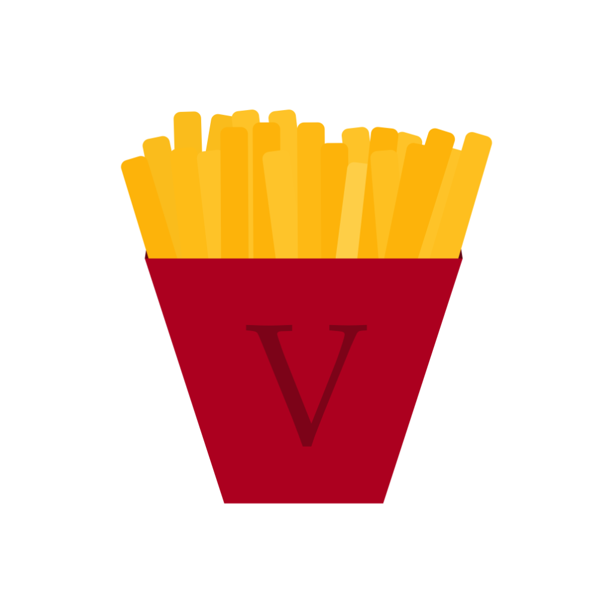
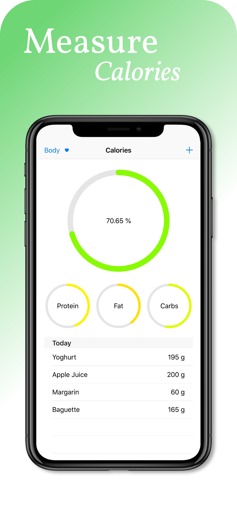
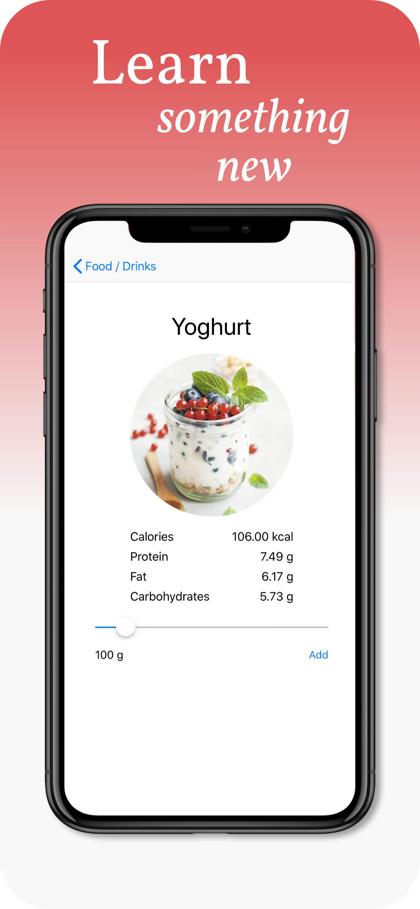
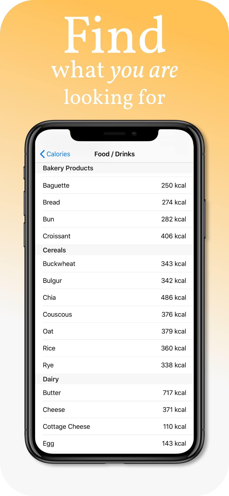

# Calorie V

A nice looking calorie counter application for iOS, with which you can measure your calorie intake for a day, and create a diary of what you eat.

You can browse trough more than 100 consumable items, which are present in the application, plus you can check how much calories, proteins, fat, and carbohydrates are in them.

You can set your age, height, and weight, with which the app can determine how much calories, protein, fat, and carbs you can consume in a day.

The food items are generalised, which is why the data used in the application might not be 100% accurate, if you are doing a drastic diet, do not rely on this application, always check the labels on the actual items, which you are consuming.

## Screenshots

